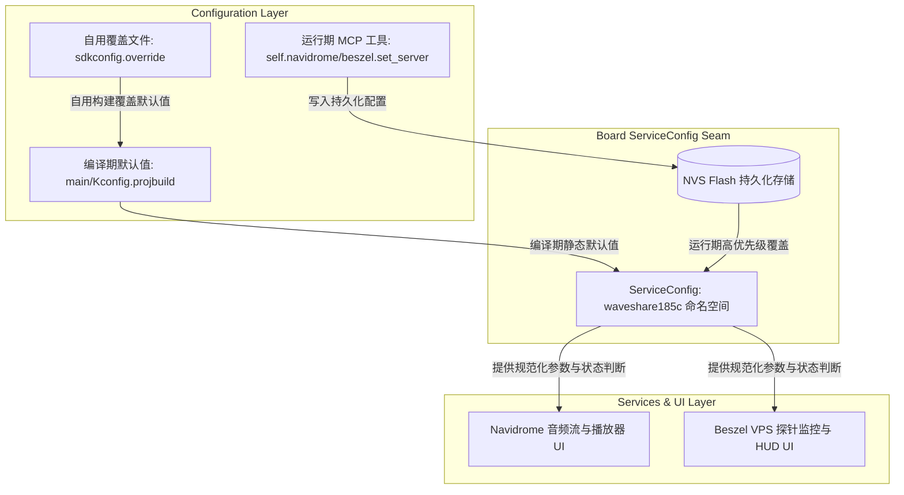

# Waveshare ESP32-S3 Touch LCD 1.85C 扩展服务配置与架构指南

---

## 1. 概述与设计目标

Waveshare ESP32-S3 Touch LCD 1.85C 板型集成了 **赛博朋克同心三环 HUD（Beszel 多 VPS 轮播监控）**、**Navidrome 个人音乐流媒体播放器** 与 **下拉控制中心手势交互**。

本方案针对第三方服务（Navidrome 和 Beszel）进行了**完全可配置化与可分发改造**，满足以下目标：
1. **安全性与分发就绪**：编译产物与源码中零硬编码私人凭据，公开固件初次启动处于安全的“未配置”状态（零网络请求），杜绝流量与凭证泄露。
2. **多层级配置能力**：支持 Kconfig 编译期默认值、NVS 运行期动态覆盖与持久化、MCP 远程配置工具。
3. **架构解耦与零侵入**：完全遵循 XiaoZhi 架构规范，全部改动严格约束在 1.85C 板级目录，对系统核心层（Application、Protocol、Audio 等）零侵入。

---

## 2. 系统架构与配置分层



### 2.1 配置优先级规则
设备在运行时统一通过板级配置模块读取参数，严格遵循以下优先级：
$$\text{运行期 NVS 持久化值} > \text{编译期 Kconfig / sdkconfig 默认值}$$

- **未配置保护**：若 URL 为空，服务判定为“未配置（Unconfigured）”，UI 呈现配置指引，**不向网络发送任何 HTTP/TCP 请求**。
- **动态生效**：通过 MCP 工具修改配置后，配置模块立即写入 NVS 并热更新内存，无需重启即可触发拉取和流媒体连接。

### 2.2 本期方案与后续演进边界
- **本期已交付（Production Ready）**：
  - 板级集中式 Kconfig 配置菜单与编译期宏开关；
  - 基于 Seam 设计的板级配置模块（`service_config.h` / `service_config.cc`），封装 NVS 读写、URL 规范化、日志脱敏与状态校验；
  - 编译期功能裁剪：可分别关闭 Navidrome 或 Beszel，完全剔除无效代码与任务开销；
  - 安全分发构建流程与凭据扫描工具（`scripts/scan_secrets.py`）。
- **后续演进规划（Future Scope）**：
  - 设备配网 Web 门户（Captive Portal）中新增扩展服务设置表单页面；
  - 将 `custom_lcd_display.cc` 中的网络请求层进一步抽离为独立的 `BeszelClient` 与 `NavidromeClient` 类，使 UI 成为完全被动的视图渲染器。

---

## 3. 面向使用者的配置指南

### 3.1 预编译固件：通过 MCP 远程工具配置（免重新编译）

如果您直接烧录了预编译的整合发布包（`merged-binary.bin`），设备初次开机连上 Wi-Fi 后处于未配置状态：
- 音乐播放器界面显示：`请配置音乐服务器`
- Beszel 监控界面显示：`请配置探针服务`

您可以通过支持 MCP 的语音助手直接发出配置指令，或通过控制台调用以下 MCP 工具：

#### 1. 配置 Navidrome 音乐服务器
- **工具名称**：`self.navidrome.set_server`
- **参数说明**：
  - `url` (string, 必填)：Navidrome 服务器地址（例如 `http://192.168.1.100:4533` 或 `https://music.example.com`，不可为空）
  - `user` (string, 选填/默认空)：登录用户名（为空时自动保留已有用户名）
  - `password` (string, 选填/默认空)：登录密码（为空时自动保留已有密码）
- **生效机制**：配置会持久化存入 NVS。保存成功后，设备立即尝试拉取曲目歌单；若认证失败或连接异常，UI 将实时呈现错误状态。支持增量更新：仅改 URL 时无需重复输入密码。

#### 2. 配置 Beszel 监控服务器
- **工具名称**：`self.beszel.set_server`
- **参数说明**：
  - `url` (string, 必填)：Beszel Hub 访问地址（例如 `http://hub.example.com:8090`，不可为空）
  - `user` (string, 选填/默认空)：Beszel 登录用户名/邮箱（为空时自动保留已有用户名）
  - `password` (string, 选填/默认空)：Beszel 登录密码（为空时自动保留已有密码）
  - `fetch_interval` (int, 选填/默认 15)：后台拉取节点状态的周期（秒，范围 1~86400；传 0 保留既有设置）
  - `carousel_interval` (int, 选填/默认 5)：表盘轮播切换不同 VPS 节点的周期（秒，范围 1~86400；传 0 保留既有设置）
- **生效机制**：配置写入 NVS 后立即生效并重置定时器，自动发起首轮节点数据查询。支持增量更新。

#### 3. 手动刷新 Beszel 监控
- **工具名称**：`self.beszel.refresh`
- **参数说明**：无参数。调用后立即异步触发一次服务器数据拉取。

---

### 3.2 源码自用构建：注入个人默认配置

如果您拥有源码并希望编译一份**烧录即用、无需再次配服务器**的专属固件：

#### 方式 A：使用未跟踪的本地覆盖配置（推荐，防泄露）
1. 在板级目录提供示例模板：`main/boards/waveshare/esp32-s3-touch-lcd-1.85c/sdkconfig.override.example`。
2. 复制为仓库根目录下的 `sdkconfig.override`（该文件已加入 `.gitignore`，不会被 Git 提交）：
   ```ini
   CONFIG_WS185C_NAVIDROME_URL="http://192.168.1.100:4533"
   CONFIG_WS185C_NAVIDROME_USER="my_user"
   CONFIG_WS185C_NAVIDROME_PASS="my_password"

   CONFIG_WS185C_BESZEL_URL="http://hub.example.com:8090"
   CONFIG_WS185C_BESZEL_USER="admin@example.com"
   CONFIG_WS185C_BESZEL_PASS="hub_password"
   CONFIG_WS185C_BESZEL_FETCH_INTERVAL=15
   CONFIG_WS185C_BESZEL_CAROUSEL_INTERVAL=5
   ```
3. 执行常规构建命令，构建脚本会自动合并该覆盖项：
   ```bash
   python3 scripts/build.py waveshare/esp32-s3-touch-lcd-1.85c
   ```

#### 方式 B：通过 `idf.py menuconfig` 图形化配置
1. 激活 ESP-IDF 环境：
   ```bash
   source /path/to/esp-idf/export.sh
   ```
2. 进入配置菜单：
   ```bash
   idf.py menuconfig
   ```
3. 导航至集中式配置路径：
   `Xiaozhi Assistant` -> `Waveshare 1.85C Extended Services`
   （该菜单在选中板型 `BOARD_TYPE_WAVESHARE_ESP32_S3_TOUCH_LCD_1_85C` 时自动呈现）。
4. 在子菜单中修改 Navidrome 或 Beszel 的地址、凭据及刷新间隔（有效范围 1~86400 秒），保存并退出。

---

### 3.3 裁剪与功能开关构建

若您不需要某些功能并希望精简固件体积、节省内存开销，可在 Kconfig 中关闭对应特性，或在覆盖配置中声明：

| 编译模式 | 配置项设置 | 代码与任务行为 | 固件体积表现 (App 分区) |
| :--- | :--- | :--- | :--- |
| **全开 (默认)** | `CONFIG_WS185C_ENABLE_NAVIDROME=y`<br/>`CONFIG_WS185C_ENABLE_BESZEL=y` | 完整包含 HUD 探针轮播、音乐播放器、手势控制中心与全部 MCP 工具 | ~2870 KB (空闲 29%) |
| **全关 (纯净)** | `CONFIG_WS185C_ENABLE_NAVIDROME=n`<br/>`CONFIG_WS185C_ENABLE_BESZEL=n` | 剥离全部第三方 HTTP 逻辑、任务及特定图标，控制中心保留基础设置 | ~2842 KB (**减少 ~28 KB**, 空闲 30%) |
| **仅 Navidrome** | `CONFIG_WS185C_ENABLE_NAVIDROME=y`<br/>`CONFIG_WS185C_ENABLE_BESZEL=n` | 剥离 Beszel 后台轮询任务与 HUD 探针圆环渲染 | ~2858 KB (空闲 29%) |
| **仅 Beszel** | `CONFIG_WS185C_ENABLE_NAVIDROME=n`<br/>`CONFIG_WS185C_ENABLE_BESZEL=y` | 剥离音频流缓冲与播放器控件，保留完整探针监控 | ~2855 KB (空闲 29%) |

---

## 4. 安全分发构建与凭据扫描

在对外发布固件或提交代码前，请执行以下标准分发流程，确保固件不含任何个人凭据：

1. **执行纯净分发编译**：
   确保当前环境中没有生效的私人覆盖配置，执行标准构建：
   ```bash
   python3 scripts/build.py waveshare/esp32-s3-touch-lcd-1.85c
   ```
2. **运行敏感凭据扫描**：
   使用内置的凭据安全检测工具扫描二进制产物或发布目录：
   ```bash
   # 单文件扫描
   python3 scripts/scan_secrets.py build/merged-binary.bin --pattern "your.private.ip" --pattern "your_password"

   # 目录递归扫描
   python3 scripts/scan_secrets.py dist/firmware_package --pattern "your.private.ip" --pattern "your_password"
   ```
   - 若扫描通过，输出 `[PASS]` 且返回码为 `0`；
   - 若发现敏感特征，输出 `[FAIL]`、脱敏信息并以返回码 `1` 中止流程。
3. **打包分发**：
   将干净的固件复制到 `dist/firmware_package/`，配合免环境刷机脚本分发给最终用户。

---

## 5. NVS 存储技术细节

板级服务配置使用 ESP32 原生 NVS 分区，参数如下：
- **NVS Namespace**: `waveshare185c`
- **键名定义**：
  - `navi_url`: Navidrome 服务器根地址（string，最大 128 字符）
  - `navi_user`: Navidrome 认证用户名（string，最大 64 字符）
  - `navi_pass`: Navidrome 认证密码（string，最大 64 字符）
  - `bsz_url`: Beszel Hub 访问地址（string，最大 128 字符）
  - `bsz_user`: Beszel 认证用户名（string，最大 64 字符）
  - `bsz_pass`: Beszel 认证密码（string，最大 64 字符）
  - `bsz_fetch_s`: Beszel 数据轮询周期（int32，单位秒）
  - `bsz_rotate_s`: Beszel HUD 节点轮播周期（int32，单位秒）

> **安全提示**：设备日志系统对读取和输出的配置已实施自动脱敏（URL 脱敏展示，密码禁止在日志和串口以明文形式打印）。
