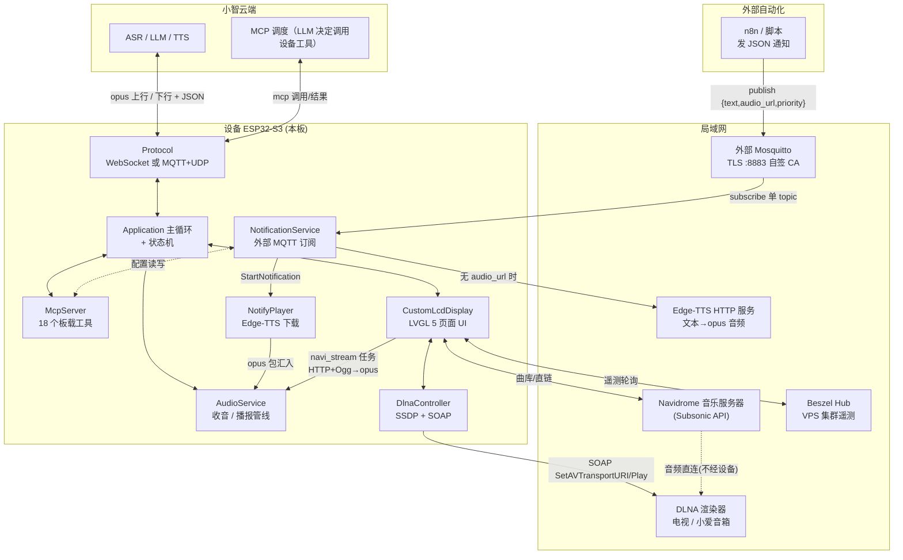
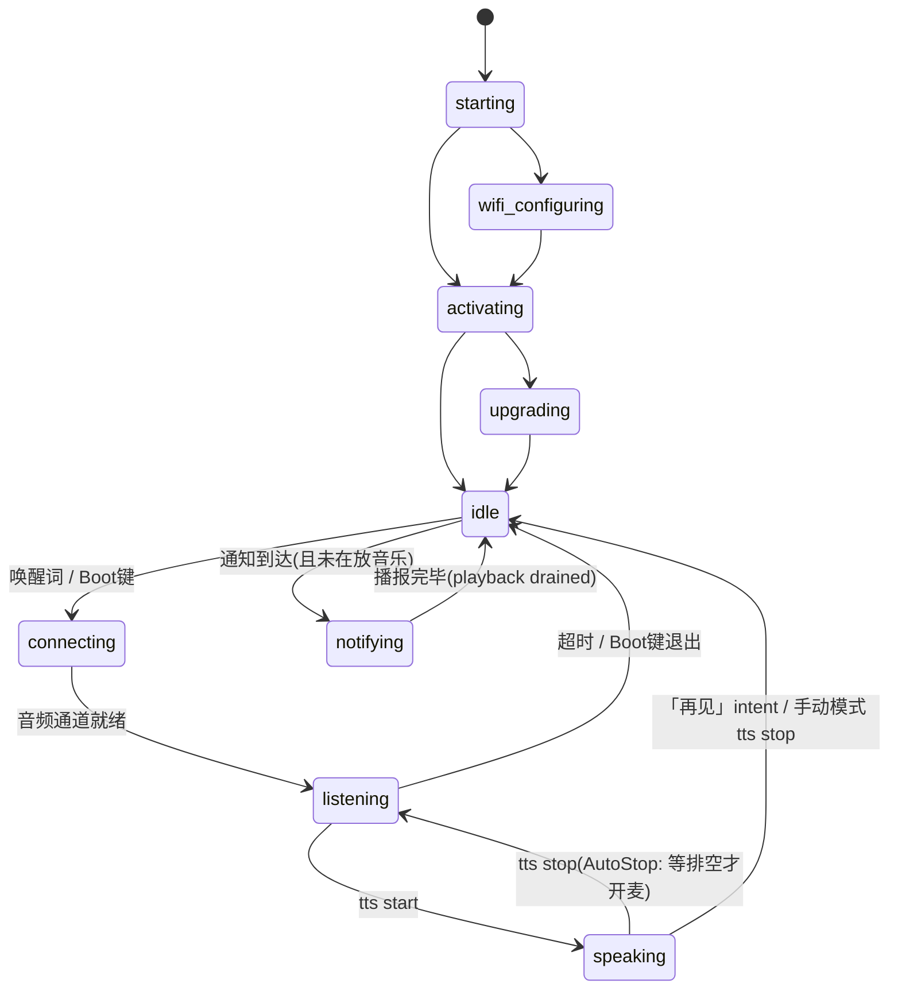
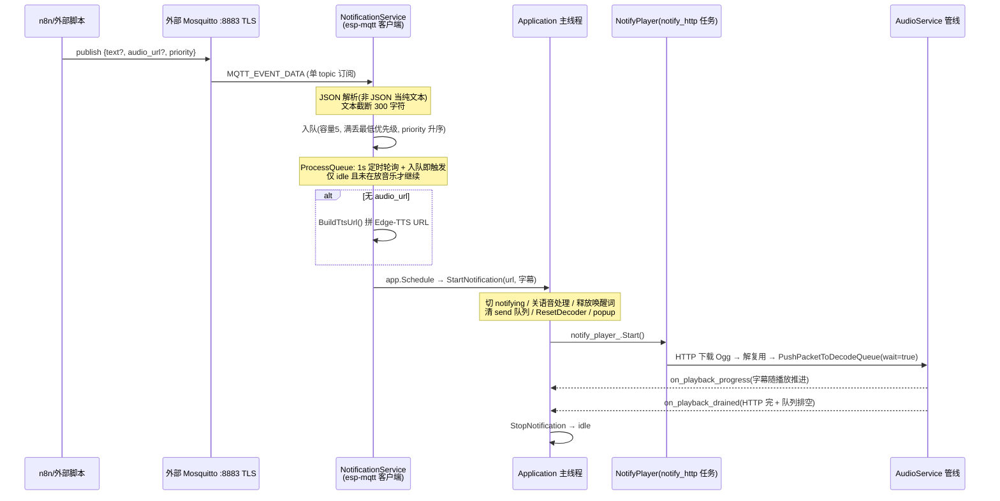
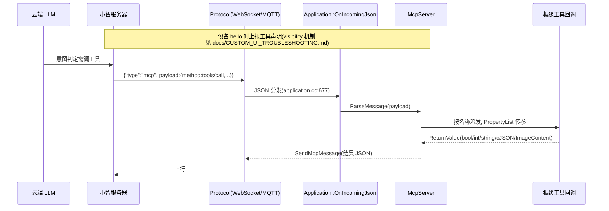
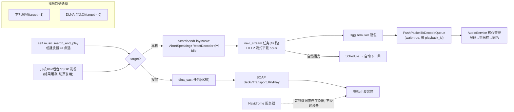

# Waveshare ESP32-S3-Touch-LCD-1.85C 项目架构说明

> 本文覆盖整个项目在 1.85c 板型上的架构：仓库结构、设备侧运行时、语音收音/播报全链路、
> 主动通知子系统（外部 MQTT 订阅）、MCP 工具子系统、音乐/DLNA 链路，以及稳定性问题的根因记录。
> 音频子系统的通用设计另见 `main/audio/README.md`；自定义 UI 排障见 `docs/CUSTOM_UI_TROUBLESHOOTING.md`。

---

## 目录

1. [系统总览](#1-系统总览)
2. [项目目录结构](#2-项目目录结构)
3. [设备侧运行时架构](#3-设备侧运行时架构)
4. [语音收音（上行）链路](#4-语音收音上行链路)
5. [语音播报（下行）链路——三源合一](#5-语音播报下行链路三源合一)
6. [设备状态机与音频联动](#6-设备状态机与音频联动)
7. [主动通知子系统（外部 MQTT 订阅）](#7-主动通知子系统外部-mqtt-订阅)
8. [MCP 工具子系统](#8-mcp-工具子系统)
9. [音乐链路：Navidrome 本机播放与 DLNA 投屏](#9-音乐链路navidrome-本机播放与-dlna-投屏)
10. [显示 / UI 子系统](#10-显示--ui-子系统)
11. [稳定性记录：重载根因与防护](#11-稳定性记录重载根因与防护)

---

## 1. 系统总览

设备同时与**三个域**通信。注意设备上有**两条完全独立的 MQTT 链路**，容易混淆：

- **主协议链路**：`WebsocketProtocol` 或 `MqttProtocol`（由 OTA 配置决定，`main/application.cc` `InitializeProtocol`）。承载对话音频（opus）与控制 JSON（tts/stt/mcp 等），对端是小智服务器。
- **通知订阅链路**：本板 `NotificationService` 自建的 `esp-mqtt` 客户端，对端是**用户自建的外部 Mosquitto**（默认 8883/TLS，内置自签 CA）。只下行收通知，与主协议无任何关系。



**关键结构事实：所有音频——服务器 TTS、通知 Edge-TTS、Navidrome 本机音乐、本地音效——最终都汇入
同一条 `AudioService` 解码/播放管线**（见 §5）。DLNA 投屏是唯一例外：音频由 Navidrome 直连渲染器，
设备只发 SOAP 控制报文，不碰音频子系统。

---

## 2. 项目目录结构

```
xiaozhi-esp32/
├── main/
│   ├── application.cc/.h          # 主事件循环(xEventGroup)、协议生命周期、状态切换副作用
│   ├── device_state_machine.cc/.h # 状态机合法转换表
│   ├── mcp_server.cc/.h           # MCP 工具注册(AddTool)与消息分发(ParseMessage)
│   ├── ota.cc  settings.cc  system_info.cc
│   ├── audio/                     # ★ 音频子系统
│   │   ├── audio_service.cc/.h    #   三任务三队列 + Opus 编解码 + 重采样
│   │   ├── codecs/                #   板级 codec: box/es8311/es8388/no_audio_codec...
│   │   ├── engines/               #   AfeAudioEngine(S3/P4/S31) / LiteAudioEngine(小目标)
│   │   ├── demuxer/ogg_demuxer.*  #   Ogg 容器解析(本地音效/通知/音乐共用)
│   │   └── wake_words/            #   唤醒词 2s 音频缓存(64KB PSRAM ring)
│   ├── protocols/                 # Protocol 抽象 + websocket_protocol + mqtt_protocol(UDP 音频)
│   ├── display/                   # 通用 LVGL 显示设施
│   ├── led/  assets/  boards/
│   ├── notify/notify_player.*     # 通知 HTTP 下载+解复用播放器(核心侧, notify_http 任务 6KB 栈)
│   ├── Kconfig.projbuild          # 板型/功能开关(含本板 WS185C_* 选项)
│   └── CMakeLists.txt             # 源/板/字库选择
├── main/boards/waveshare/esp32-s3-touch-lcd-1.85c/   # ★ 本板全部定制
│   ├── esp32-s3-touch-lcd-1.85c.cc   # 板级入口: 硬件初始化、Boot键、MCP工具注册、HeapDiag
│   ├── custom_lcd_display.cc/.h     # LVGL 全部 UI: 5页面、VU、倒计时、语音HUD、Navidrome播放器
│   ├── notification_service.cc/.h   # 外部 MQTT 订阅 + Edge-TTS 通知编排(§7)
│   ├── service_config.cc/.h         # NVS 配置中心: Navidrome/Beszel/Notify 三组(§7)
│   ├── dlna_controller.cc/.h        # SSDP 发现 + SOAP 投屏控制(§9)
│   ├── config.h                     # 引脚、采样率(24k入/24k出)、AUDIO_INPUT_REFERENCE=true
│   ├── config.json                  # 构建链入口(config.json→build.py→Kconfig→CMakeLists)
│   └── font_maison_neue_book_14.c   # 自定义字体(16px 全量中文点阵, 修复缺字)
├── docs/                           # websocket.md / mqtt-udp.md / mcp-protocol.md / CUSTOM_UI_TROUBLESHOOTING.md
├── scripts/build.py                # 构建入口: python3 scripts/build.py <board> --name <variant>
├── partitions/  docker/  tools/
└── managed_components/             # IDF 托管依赖(勿手改)
```

板选链（新增板/变体时必须整链更新）：`config.json → scripts/build.py → main/Kconfig.projbuild →
main/CMakeLists.txt → 板源码 + config.h`，详见 `docs/custom-board.md`。

---

## 3. 设备侧运行时架构

### 3.1 FreeRTOS 任务清单

| 任务 | 栈 | 优先级 | 归属 | 职责 |
|---|---|---|---|---|
| main | — | — | `Application::Run` | 事件组循环：发音频、状态切换、唤醒/VAD 事件 |
| audio_input | 6K | 8 (核0) | `audio_service.cc:128` | 读 codec → 重采样 24k→16k → 喂 AFE |
| opus_codec | 24K | 2 | `audio_service.cc:165` | opus 编码(上行)/解码(下行) + 输出重采样 |
| audio_output | 4K | 4 | `audio_service.cc:137` | 排空 playback 队列 → ES8311 DAC → PA |
| AFE processing | 4K | — | ESP-SR | AEC + VAD + WakeNet 推理 |
| LVGL | — | — | display | 全部 UI 渲染 |
| notify_http | 6K | — | `notify_player.cc:65` | 通知音频 HTTP 下载 + Ogg 解复用 |
| navi_stream | 4K | 3 | `custom_lcd_display.cc:2990` | Navidrome 本机播放流下载 |
| dlna_cast / dlna_pause | 4K / 3K | 3 | 同上 | SOAP 推流/暂停 |
| dlna discovery | (SSDP) | — | `dlna_controller.cc` | 后台发现，结果缓存 |
| esp_timer 任务 | — | — | 系统 | audio_power(15s 断电)、notify_queue_chk(1s)、HeapDiag(250ms)、dlna_init_scan(开机10s) |

### 3.2 队列与容量（全部固定容量，无 deque 动态节点）

| 队列 | 容量 | 满策略 |
|---|---|---|
| `audio_encode_queue_` | 2 任务 | 丢最旧（实时音频绝不阻塞 AFE） |
| `audio_send_queue_` | 40 包 ≈ 2.4s | 丢最旧 |
| `audio_decode_queue_` | 20 包 ≈ 1.2s | 服务器 TTS：丢；通知/音乐(wait=true)：阻塞背压 |
| `audio_playback_queue_` | 2 任务 | OpusCodecTask 消费前限流 |
| 通知队列 `queue_` | 5 条 | 丢最低优先级/最老，按 priority 升序（数值小先播） |

### 3.3 板级硬件（V2.0 变体）

- codec：`BoxAudioCodec`（ES8311 DAC + ES7210 ADC，PA=GPIO15，input gain 36dB）
- 采样率：输入 24000 / 输出 24000；声道 `M+MR`（ES7210 双通道 = 麦克风 + **喇叭回声参考**，不是双麦）
- `CONFIG_USE_DEVICE_AEC` 当前**未启用** → 本地 AEC 关闭，默认监听模式 AutoStop（VAD 断句）；
  硬件参考通道已接好，可运行时 `Application::SetAecMode()` 动态打开
- 显示：360×360 QSPI ST77916 + 触摸；开机音量 30

---

## 4. 语音收音（上行）链路

```
┌──────────┐  24kHz 双声道(MIC+回声参考)      ┌─────────────────────────────────────┐
│ ES7210   │────────────────────────────────▶│ AudioInputTask  (核0, prio 8)       │
│ ADC      │                                 │  ReadAudioData(): 每次 10ms         │
└──────────┘                                 │  输入重采样 24k→16k(2ch)            │
                                             └──────────────┬──────────────────────┘
                                                            │ Feed()
                                                            ▼
                                             ┌─────────────────────────────────────┐
                                             │ AfeAudioEngine  (独立 AFE 任务)      │
                                             │  ESP-SR AFE: FD-AEC + VAD           │
                                             │  + WakeNet 唤醒词                   │
                                             └───┬──────────────┬──────────┬───────┘
                              唤醒词命中(附2s PSRAM缓存)  │   VAD 状态   │  干净 16k 单声道
                                                 │          │            │ OnOutput()
                                                 ▼          ▼            ▼
                                        MAIN_EVENT_WAKE_   on_vad_   audio_encode_queue_(2)
                                        WORD_DETECTED      change          │
                                                                        ▼
                                             ┌─────────────────────────────────────┐
                                             │ OpusCodecTask: Opus 编码            │
                                             │  16kHz / 60ms 帧 / complexity 0     │
                                             │  VBR + DTX                          │
                                             └──────────────┬──────────────────────┘
                                                            ▼
                                              audio_send_queue_(40包≈2.4s, 满丢最旧)
                                                            │ on_send_queue_available()
                                                            ▼ MAIN_EVENT_SEND_AUDIO
                                             ┌─────────────────────────────────────┐
                                             │ Application::Run 主循环              │
                                             │  → protocol_->SendAudio()           │
                                             │  (WebSocket 二进制 / MQTT+UDP)       │
                                             │  发送失败则清空 send 队列防编码死锁   │
                                             └─────────────────────────────────────┘
```

设计要点：

- **实时音频全线"满则丢最旧、绝不阻塞"**（encode/send 两级队列），网络拥塞时宁可丢帧也不倒灌卡死 AFE 任务。
- 唤醒词命中时，最近 2 秒 PCM 存于单个 64KB PSRAM 环形缓存，按 opus 帧编码后随 `wake_word_detected`
  一起上传，避免内部 SRAM 反复分配。
- VAD 状态经 `on_vad_change` 上报；本板 UI 还会轮询 `IsVoiceDetected()` 驱动 VU 频谱和
  "说话取消倒计时"（§10）。

## 5. 语音播报（下行）链路——三源合一

```
 服务器 TTS            通知 Edge-TTS              Navidrome 本机音乐
 (WebSocket/MQTT)      NotifyPlayer 独立任务       navi_stream 独立任务
      │                HTTP下载+OggDemuxer         HTTP下载+OggDemuxer
      │ OnIncomingAudio       │                        │
      │ (仅speaking态收)      │ PushPacketToDecodeQueue │ (wait=true 背压)
      │                       │ (wait=true 背压,带playback_id进度)
      └───────────────┬───────┴────────────────────────┘
                      ▼
            audio_decode_queue_ (20包≈1.2s)
                      │
                      ▼
          ┌─────────────────────────────────────────┐
          │ OpusCodecTask                           │
          │  按包头调 SetDecodeSampleRate()          │
          │  ├ Opus 解码器: 仅采样率变化时重建        │
          │  └ 输出重采样 X→24kHz: 仅变化时重建 ★   │
          └──────────────┬──────────────────────────┘
                         ▼
            audio_playback_queue_ (2)
                         │
                         ▼
          ┌─────────────────────────────────────────┐
          │ AudioOutputTask → ES8311 → PA → 喇叭     │
          │  每帧后检查 drained → on_playback_       │
          │  drained                                │
          └─────────────────────────────────────────┘

  抢占/清场: ResetDecoder() = playback_generation_++(在途包作废)
            + 清三个队列 + opus_dec_reset
  本地音效: PlaySound(OGG popup 等) 同样经 OggDemuxer 进 decode 队列
```

★ 即提交 `1ef8d6a` 的修复点：重采样器是有相位状态的状态机，且旧版 `esp_ae_rate_cvt_close`
释放不干净——只在解码采样率**真正变化**时才重建（`output_resampler_rate_` 记录当前源率），
否则 16k/48k 来回切会泄漏内部 SRAM（§11）。

两个基石机制：

- **`on_playback_drained`**：AutoStop 模式下 `tts stop` 后等播放队列排空才开麦（`pending_listening_start_`）；
  通知播报以"HTTP 结束且播放排空"为完成条件。
- **`playback_generation_` 代际作废**：打断/切歌/通知启停都靠 `ResetDecoder()` 递增代际，
  在途包解码完发现代际不符直接丢弃，避免"回到桌面后补播上一段"。

## 6. 设备状态机与音频联动



`HandleStateChangedEvent` 的音频副作用（`main/application.cc`）：

| 进入状态 | 音频动作 |
|---|---|
| speaking | `ResetDecoder()` + 关语音处理（AFE 唤醒词保留，故播报中仍可被唤醒打断） |
| listening | `SendStartListening` + `EnableVoiceProcessing(true)` + popup 音效 |
| idle | `EnableVoiceProcessing(false)` + `EnableWakeWordDetection(true)` |
| notifying | 关语音处理 + 释放唤醒词资源 + 清 send 队列 + `ResetDecoder()` + popup |

打断共四条路：唤醒词打断（speaking 期间 WakeNet 仍在跑）、Boot 键打断（板级：
`AbortSpeaking` + `ResetDecoder` + 直切 listening，`esp32-s3-touch-lcd-1.85c.cc:447`）、
服务器主动结束、语音点歌（`SearchAndPlayMusic`：打断 + 清场 + 回 idle 再起播）。

## 7. 主动通知子系统（外部 MQTT 订阅）

配置全部走 `ServiceConfig`（NVS namespace `waveshare185c`，Kconfig 提供默认值），三组配置：
`NavidromeConfig` / `BeszelConfig` / `NotifyConfig`。`NotifyConfig` 含 MQTT(host/port/user/pass/topic)
+ Edge-TTS(base_url/token/voice/format)，port=8883 自动启用 TLS（内置自签 CA，CN=xiaozhi-notify）。



防护细节：

- **严格状态保护**：仅 `kDeviceStateIdle` 且未在放本机音乐才起播；`Schedule` 到主线程后二次校验状态，
  若最后一刻被唤醒则把消息**推回队列**。
- 通知播报与对话共用管线，抢占/清场全靠 `playback_generation_` 代际（§5）。
- 板级网络回调启停服务：WiFi 连接 `Start()`、断开 `Stop()`（`esp32-s3-touch-lcd-1.85c.cc:930`）。
- 语音侧也可以管它：`self.notify.status / test / set_config` 三个 MCP 工具（§8）。

## 8. MCP 工具子系统

### 8.1 调用链



### 8.2 本板工具清单（`esp32-s3-touch-lcd-1.85c.cc` `InitializeTools`）

| 域 | 工具 | 作用 | 条件 |
|---|---|---|---|
| 系统 | `self.system.reconfigure_wifi` | 结束对话进入配网模式 | 无 |
| 页面/天气 | `self.weather.update_tomorrow` | 更新明日天气卡片数据(city/weather/temp/...) | 无 |
| | `self.weather.switch_page` | 切页面: player/weather/settings/server/home | 无 |
| 音乐 | `self.navidrome.set_server` | 配置 Navidrome 并存 NVS | `WS185C_ENABLE_NAVIDROME` |
| | `self.music.play_pause` / `next` / `prev` / `refresh` | 播放控制/刷新曲库 | 同上 |
| | `self.music.get_stream_url` | 取当前曲原生直链(给第三方设备播) | 同上 |
| | `self.music.search_and_play` | 【点歌首选】搜私有曲库并起播；`target` 指定投播设备(留空=本机喇叭) | 同上 |
| DLNA | `self.dlna.list_devices` | 列出局域网渲染器及当前投播目标 | 同上 |
| | `self.dlna.scan` | 触发后台 SSDP 扫描 | 同上 |
| | `self.dlna.cast` | 切换投播目标(名称/索引/local) | 同上 |
| | `self.dlna.add_device` | 按 IP 手动探测添加(应对组播被禁) | 同上 |
| 监控 | `self.beszel.set_server` / `refresh` | 配置/刷新 VPS 集群遥测 | `WS185C_ENABLE_BESZEL` |
| 通知 | `self.notify.status` | 查询通知通道状态与队列 | 无 |
| | `self.notify.test` | 模拟播报一条测试通知 | 无 |
| | `self.notify.set_config` | 动态改 MQTT/Edge-TTS 配置并存 NVS | 无 |

工具回调大多直接操作 `CustomLcdDisplay` 或单例服务；返回值统一为 JSON 字符串
（cJSON 构造，所有权在回调内释放）。

## 9. 音乐链路：Navidrome 本机播放与 DLNA 投屏



- **本机播放**与对话/通知共用管线，切歌靠 `ResetDecoder()` 代际作废在途包；
  停止时 `stream_stop_requested_` + `current_playback_id_++` 双保险。
- **DLNA 投屏**设备只做控制面（SSDP 发现 + 设备 XML 流式探测 + SOAP 指令），音频面由
  Navidrome 直连渲染器——设备零音频负载。
- 唤醒/Boot 键会暂停投屏音乐（`auto-pause music on wake`）。

## 10. 显示 / UI 子系统

`custom_lcd_display.cc`（约 5000 行）承载全部 UI：5 个页面（home 时钟+表情 / player 播放器 /
weather 明日天气 / settings 控制中心 / server 集群监控），外加全屏语音 HUD（唤醒覆盖层）。

与音频子系统的联动点（最近多次修复的"战场"）：

- **VU 频谱**：仅 LISTENING 分支显示；动画轮询 `IsVoiceDetected()`。
- **10s 自动退出倒计时**：对话回待机/通知播完启动；**待机等待期内检测到说话会取消倒计时**（VAD 轮询）。
  修复历史：TTS 尾音的 VAD 曾误杀刚启动的倒计时（2b33224 引入 `countdown_start_seconds_`
  守卫：倒计时至少递减 1 秒后才允许被取消）；VU 隐藏时的提前 return 是承重结构，去掉会让
  通知自身的尾音取消倒计时（4d7d6ab 回滚并加注释）。
- 流式对话文本缓冲、Boot 键即时呼出 HUD、倒计时即时消除等交互见 `custom_lcd_display.cc`。

## 11. 稳定性记录：重载根因与防护

设备"重载"（异常重启）已定位的两个根因，均为 2026-10-05 前后修复：

| # | 根因 | 机制 | 修复 |
|---|---|---|---|
| 1 | 输出重采样器反复重建 | 服务端每下发 opus header 就调 `SetDecodeSampleRate`；采样率在 TTS/音乐/通知间来回切时无条件 close/open 重采样器，`esp_ae_rate_cvt_close` 释放不干净，内部 SRAM 累积泄漏，`heap_caps_get_minimum_free_size` 跌至个位数 → 分配失败 → panic 重启 | `1ef8d6a`：记录 `output_resampler_rate_`，仅采样率真正变化时重建 |
| 2 | SSDP 发现任务栈溢出 | DLNA 发现任务栈过小，解析 SSDP 响应 + 设备 XML 探测打爆栈 | `8993dd5`：加大任务栈；`58ceb40`：XML 流式裁剪 + 设备缓存降峰值内存 |

常驻监控（`esp32-s3-touch-lcd-1.85c.cc:874-897`）：

- `heap_caps_register_failed_alloc_callback`：分配失败即打 `func=`（直接指认责任组件）。
- 250ms 周期 HeapDiag：内部 SRAM < 24KB 告警（free/largest/设备状态）。

已知残留风险（观察项）：

1. **内部 SRAM 并发压力**：TLS 通知客户端 + DLNA HTTPS 探测 + LVGL 360×360 全量中文字库 +
   Opus/AFE/WakeNet 常驻；"本机放音乐 + 收通知 + DLNA 扫描"并发是最易触底场景。
2. **自建任务栈偏紧**：`navi_stream`(4096)、`dlna_pause`(3072) 上有完整 HTTP+解复用调用链，
   建议加 `uxTaskGetStackHighWaterMark` 打点（SSDP 溢出是前车之鉴）。
3. Boot 键回调直接调 `AbortSpeaking/SetDeviceState`（未 `Schedule` 到主任务），与主循环存在
   理论竞态，属项目规则红线（AGENTS.md），非已证实崩溃源。

---

*文档基于 2026-10-06 的 zcode 分支代码梳理；引用行号随代码演进可能漂移。*
